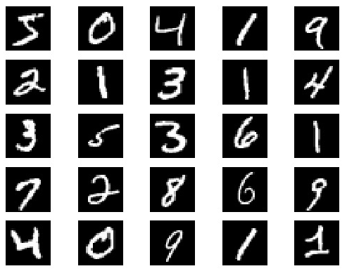
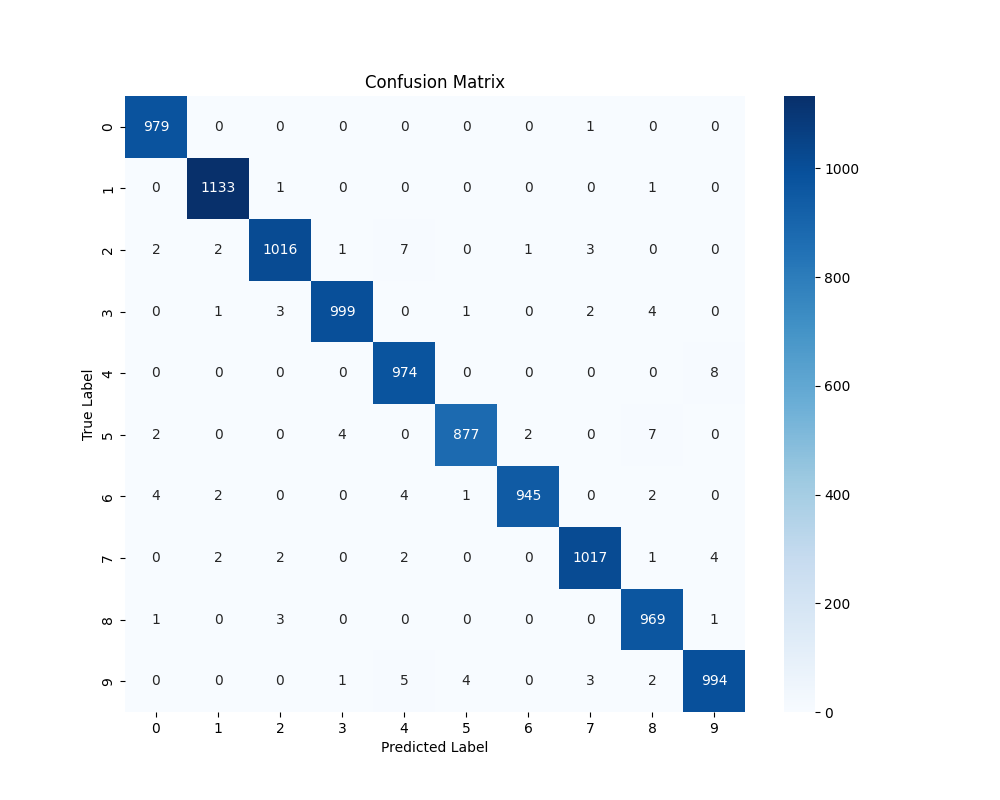

# **基于PyTorch的MNIST手写数字识别（配置手写板使用）**


## 项目介绍

本项目实现了一个基于PyTorch的MNIST手写数字识别系统，包含完整的训练、评估和可视化界面功能。系统使用卷积神经网络(CNN)模型，能够识别0-9的手写数字，并提供了友好的GUI界面进行实时手写识别。

## 环境配置

+ Python 3.7+

必须库：

```bash
pip install torch torchvision numpy pandas matplotlib seaborn PyQt5
```

## 项目文件夹结构：

```markdown
CNN_MNIST/
├── MINIST-master/data/          # MNIST数据集
│   ├── train-images-idx3-ubyte.gz # (9.9 MB, 解压后 47 MB, 包含 60,000 个样本)
│   ├── train-labels-idx1-ubyte.gz # (29 KB, 解压后 60 KB, 包含 60,000 个标签)
│   ├── t10k-images-idx3-ubyte.gz  # (1.6 MB, 解压后 7.8 MB, 包含 10,000 个样本)
│   └── t10k-labels-idx1-ubyte.gz  # (5KB, 解压后 10 KB, 包含 10,000 个标签)
├── utils/
│   └── data_loader.py          # 数据加载和预处理
├── train.py                    # 模型训练脚本
├── evaluate.py                 # 模型评估脚本
├── handwriting_ui.py           # 手写识别GUI界面
└── final_model.pth             # 训练好的模型权重
```

## 数据集介绍
使用标准MNIST数据集：

- **训练集**：60,000张28x28灰度手写数字图像
- **测试集**：10,000张28x28灰度手写数字图像
- **数字范围**：0-9



## 数据预处理
1. **图像归一化**：像素值缩放到[0,1]范围
3. **数据增强**：
   - 随机旋转(±15度)
   - 随机缩放(0.9-1.1倍)
   - 随机平移(±2像素)
## 训练流程
1. 初始化CNN模型
2. 设置损失函数(交叉熵)和优化器(Adam)
3. 训练10个epoch
4. 每100个batch打印训练进度
5. 保存模型检查点和最终模型

训练损失如下所示：


使用准确率（Accuracy）、召回率（Recall）、F1分数（f1-score）对模型进行评估，结果如下所示：


混淆矩阵如下所示：



手写板的UI界面如下所示：

